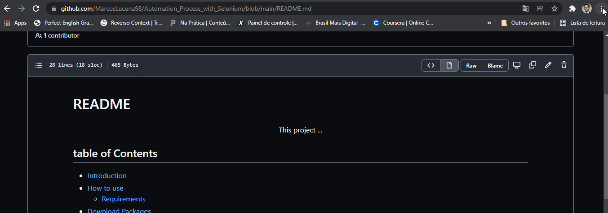

# README

This project ...

## table of Contents

* [Introduction](#Introduction)
* [How to use](#How-to-use)
    * [Requirements](#Requirements)
* [Download Packages](#Download-packages)
* [Import Module](#Import-Module)

 

<h4 align="center">
    ⌛ README Project is under Construction ... ⏳
</h4>

### Features

- [x] Make Title
- [x] Make Table of Contents
- [ ] Make Introduction
- [ ] How to Use
- [x] Make Requirements
- [x] Make Download Packages
- [ ] make Import Module

# ⁉️ Introduction

# ⏯️ How to use

# 🧾 Requirements

To run this program, you will need to download the following tools:
[Python](https://www.python.org/downloads/), [Git](https://git-scm.com/downloads) and
[ChromeDriver](https://chromedriver.chromium.org/downloads). Choice your Chrome browser version and Download.

    - If you don't know where to find the Chrome version, watch the gif below.

# 🔽 Download Packages

we run the following Packages in the program that allow us to create the code:
- to install [Selenium](https://selenium-python.readthedocs.io/installation.html), execute "pip install selenium" in your code editor. 
- And to install [Pandas](https://pandas.pydata.org/docs/getting_started/index.html#getting-started) execute "pip install pandas".

# 📚 Import-Module

In this project, we used selenium to automate a process of getting the price of Gold, Euro and Dollar.

Made by Marcos Lucena 🤵 [see my linkedIn](https://www.linkedin.com/in/lucenamarcos/)