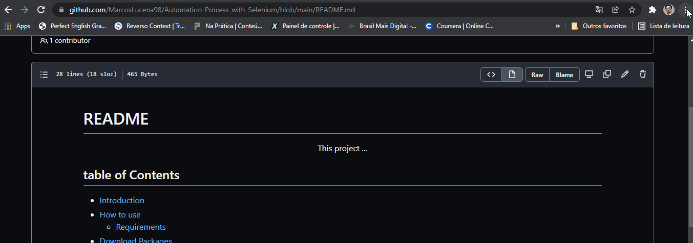

# **README** <!-- omit in toc -->

<p align="center">This project ...</p>

## **Table of Contents** <!-- omit in toc -->

- [⁉️ **Introduction**](#️-introduction)
- [⏯️ **How to use**](#️-how-to-use)
- [🧾 **Requirements**](#-requirements)
- [🔽 **Download Packages**](#-download-packages)
- [📚 **Import Module**](#-import-module)

<br>

<h4 align="center">
    ⌛ README Project is under Construction ... ⏳
</h4>

### *Features*

- [x] Make Title
- [x] Make Table of Contents
- [x] Make Introduction
- [ ] How to Use
- [x] Make Requirements
- [x] Make Download Packages
- [ ] make Import Module

# ⁉️ **Introduction**

This program is a process automation used to solver a problem that affects an international Importer. 
The Importer calculates the purchase prices and sales price according to the current dollar price, Gold price and Euro price.
This program has to do the get of the current prices in the Browser Internet, calculates the purchase price and sales price and update the database with the new values.

# ⏯️ **How to use**


# 🧾 **Requirements**

To run this program, you will need to download the following tools:
[Python](https://www.python.org/downloads/), [Git](https://git-scm.com/downloads) and
[ChromeDriver](https://chromedriver.chromium.org/downloads).
Choose your Chrome browser version on the website and Download.

    - If you don't know where to find the Chrome version, watch the gif below.



Moreover, install a code editor like [VSCode](https://code.visualstudio.com/) for you work in your code.

# 🔽 **Download Packages**

Run the following Packages in the program that allow us to create the code:
- to install [Selenium](https://selenium-python.readthedocs.io/installation.html), execute "pip install selenium" in your code editor. 
- And to install [Pandas](https://pandas.pydata.org/docs/getting_started/index.html#getting-started) execute "pip install pandas". 


# 📚 **Import Module**

This program uses the following modules that belong to the packages mentioned above:
```bash

# Import package Selenium

from selenium import webdriver
from selenium.webdriver.common.by import By
from selenium.webdriver.common.keys import Keys

# Import Package Pandas

import pandas as pd

```


   
Made by Marcos Lucena 🤵 [see my linkedIn](https://www.linkedin.com/in/lucenamarcos/)